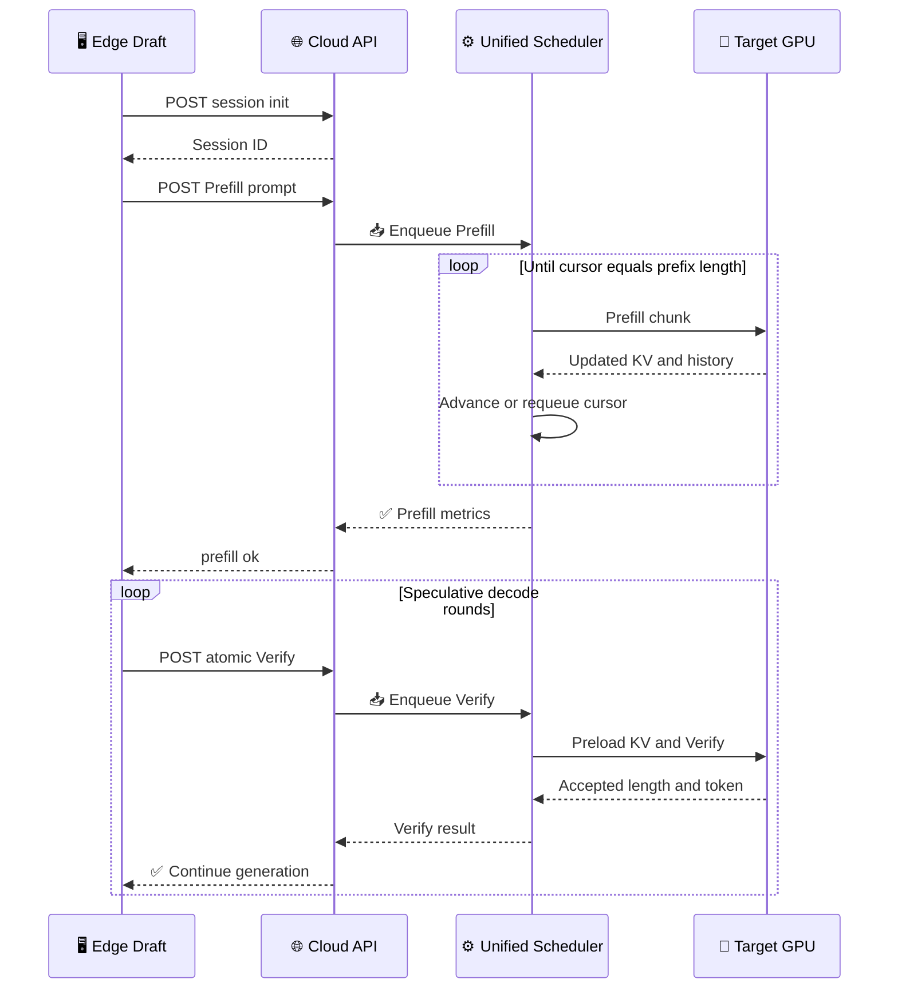
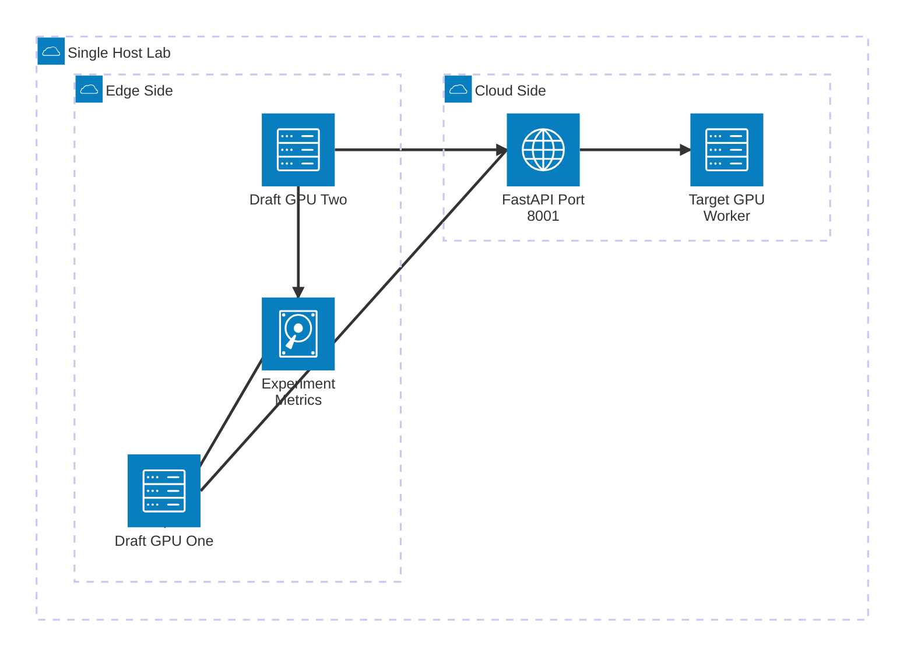

# FastSD TODO 实现与多 GPU 实验指南

_实现验收、启动手册与云边协同实验设计；基于 `plan` 分支，2026-08-05_

---

## 📋 目录

- [结论与证据边界](#-结论与证据边界)
- [TODO 完成清单](#-todo-完成清单)
- [统一调度器语义](#-统一调度器语义)
- [验证结果](#-验证结果)
- [环境准备与首次启动](#-环境准备与首次启动)
- [多 GPU 云边协同部署](#-多-gpu-云边协同部署)
- [实验设计](#-实验设计)
- [故障排查与限制](#-故障排查与限制)
- [参考资料](#-参考资料)

## 📋 结论与证据边界

当前仓库的 `V1-UNIFIED-SCHED-0` 至 `V1-UNIFIED-SCHED-11` 已全部实现。FastSD 模式现在使用一个持久化的 `6:3:1` WRR 调度状态，在每个 tick 内共享一个有效 token 预算，将 Verify 保持为原子请求，将 Prefill 切分为可续跑的 chunk，并按 `max_num_seqs` 执行同构 micro-batch。`pipeline` 与 `vanilla` 仍走严格 FCFS 单请求路径。

本次验证包括 38 项单元测试、1000 组随机化调度不变量、Python 编译、Shell 语法、CLI 参数拒绝和主服务导入。测试环境能够导入 CUDA 版 PyTorch，但分块 KV 测试使用的是 CPU 上的可控假模型。

> ⚠️ **验证边界：** 当前机器只有一张 4 GB RTX 3050 Laptop GPU，且仓库期望的 `../models` 模型目录不存在，因此没有执行真实模型端到端推理、真实多 GPU 并发、RDMA 或跨节点性能测试。后文的多 GPU 命令是经过代码路径核对的可执行实验方案，不是已经得到的性能结果。

> 📌 **Git 状态：** 本轮开始前，5 个 TODO 设计文件已经处于 staged 状态；完成后的实现目前在 working tree 中。提交前应先检查 `git diff HEAD`，再统一 stage，避免只提交旧的设计注释版本。

## ✅ TODO 完成清单

| TODO | 已实现行为 | 主要代码 | 验证 |
| --- | --- | --- | --- |
| `V1-UNIFIED-SCHED-0` | 新增正整数参数 `max_num_seqs=4`、`prefill_max_wait_cycles=2`；校验 `token_budget` | [`src/util.py`](../src/util.py) | CLI 单测与非法值启动检查 |
| `V1-UNIFIED-SCHED-1` | 统一 Prefill、tail-only Verify、full-prefix Verify 的有效 token 计费；超预算 Verify 明确拒绝 | [`src/fastsd_scheduler.py`](../src/fastsd_scheduler.py) | 三类成本、原子拒绝测试 |
| `V1-UNIFIED-SCHED-2` | 用 `ScheduleEntry` 与 `SchedulePlan` 表示一个 tick 的混合准入计划 | [`src/fastsd_scheduler.py`](../src/fastsd_scheduler.py) | 计划字段与任务同质性测试 |
| `V1-UNIFIED-SCHED-3` | `UnifiedSchedulerState` 跨 tick 保存 WRR 游标；空槽也推进，完整无进展周期后停止 | [`src/fastsd_scheduler.py`](../src/fastsd_scheduler.py) | 持久游标、精确回绕、空周期测试 |
| `V1-UNIFIED-SCHED-4` | short/mid/long 独立记录 Prefill 等待周期；到期类别在下一个本类槽位强制一个 chunk | [`src/fastsd_scheduler.py`](../src/fastsd_scheduler.py) | 三类独立计数、两周期强制、预算耗尽保留测试 |
| `V1-UNIFIED-SCHED-5` | 全局预算下 Verify 优先；放不下当前剩余预算时保留 Verify，并用 Prefill chunk 利用余量 | [`src/fastsd_scheduler.py`](../src/fastsd_scheduler.py) | 预算不超限、尽力分发、延迟 Verify 测试 |
| `V1-UNIFIED-SCHED-6` | 每 tick 最多执行 `6 * max_num_seqs` 次非阻塞 ingress 读取 | [`src/fastsd_scheduler.py`](../src/fastsd_scheduler.py)、[`src/engine.py`](../src/engine.py) | 读取次数与终止哨兵测试 |
| `V1-UNIFIED-SCHED-7` | 替换旧 `schedule_tasks()`；所有 Verify micro-batch 先执行，再执行 Prefill micro-batch | [`src/engine.py`](../src/engine.py) | 执行顺序、同构任务、batch 上限测试 |
| `V1-UNIFIED-SCHED-8` | 只按计划预加载 Verify KV；同步加载首批，并让下一批预加载与当前 forward 重叠 | [`src/engine.py`](../src/engine.py) | 计划顺序测试与静态调用链检查 |
| `V1-UNIFIED-SCHED-9` | Prefill 游标、分块续跑、cache offload/reload、未完成重排队、最终一次响应 | [`src/engine.py`](../src/engine.py) | 游标生命周期与恰好一次完成测试 |
| `V1-UNIFIED-SCHED-10` | 新增部分 Prefill forward；续接不同 cache 长度会话，剔除 padding gap，只追加有效 KV/logits | [`src/kvcache_batching.py`](../src/kvcache_batching.py) | 真实张量的两会话 KV 连续性测试 |
| `V1-UNIFIED-SCHED-11` | 扩展调度、CLI 与分块 KV 测试 | [`tests/test_fastsd_scheduler.py`](../tests/test_fastsd_scheduler.py)、[`tests/test_chunked_prefill.py`](../tests/test_chunked_prefill.py) | 完整测试集 38/38 |

计划模板中的 4 个示例标记不是待实现功能，现已明确改名为 `PLACEHOLDER`。运行时代码与测试目录扫描不到 `TODO`、`FIXME`、`HACK` 或 `XXX`。

### 额外实验支持

- Cloud 对超预算 Verify 返回结构化错误，Edge 会立即显示错误原因
- Cloud 记录服务端 monotonic 入队时刻，Prefill 响应新增 `prefill_queue_ms`、`prefill_service_ms` 与 `prefill_chunks`
- Edge 的逐任务 JSONL 与汇总 JSON 新增 Prefill 指标
- `max_tasks_per_draft` 不再被硬编码的单任务切片覆盖，可控制每个 Draft 进程的真实实验任务数
- `install.sh` 已统一为 PyTorch `2.2.1`、TorchVision `0.17.1`、TorchAudio `2.2.1` 的 CUDA 12.1 组合；该组合与 PyTorch 官方历史版本表一致[^1]

## ⚙️ 统一调度器语义

### 有效 token 计费

对请求或 Prefill 分块 $r$，调度成本定义为：

$$
C(r)=
\begin{cases}
\text{chunk\_end}-\text{chunk\_start}, & \text{Prefill} \\
\lvert\text{payload}\rvert, & \text{tail-only Verify} \\
\max(1, \lvert\text{payload}\rvert-\text{prefix\_len}), & \text{full-prefix Verify}
\end{cases}
$$

每个计划满足：

$$
\sum_{r \in \text{plan}} C(r) \leq \text{token\_budget}
$$

Verify 不能切分。若单个 Verify 的 $C(r) > \text{token\_budget}$，Cloud 返回 `verify_exceeds_token_budget`，而不是让它超预算执行或永久堵塞队首。Prefill 可以切到当前剩余预算，因此长 prompt 会跨多个 tick 续跑。

> 📌 **重要：** `token_budget` 是准入账本，不是严格 FLOPs、显存或时间上限。模型 forward 仍会把输入 pad 成 `[B, T_chunk_max]`，KV 也会形成按当前 batch 最大 cache 长度对齐的密集张量。

### WRR、公平性与最坏等待

一个完整周期固定访问 `short × 6 → mid × 3 → long × 1`。游标只有在访问槽位后才推进，并跨 tick 保存。

当某类别仍有 Prefill，但一个完整周期没有准入该类别的任何 Prefill chunk 时，该类别的 `prefill_wait_cycles` 加一。默认连续错过 2 个周期后，其下一个本类槽位先准入一个 Prefill chunk，再恢复通常的 Verify 优先选择。

- 若预算在到达应执行槽位前耗尽，游标与到期计数保留到下一个 tick
- 若队列变空或成功准入一个 chunk，只重置该类别计数
- 若请求刚错过本类槽位，调度机会的最坏界限小于 `prefill_max_wait_cycles + 1` 个完整 WRR 周期；默认值 2 对应少于 30 次槽位访问
- 该界限不是墙钟 SLA；GPU forward、HTTP、进程调度或故障仍会增加真实等待时间
- 强制路径每个到期类别只取一个 chunk，且其他槽位仍可准入 Verify，因此不会把公平性修复变成全局 Prefill 独占

### 分块 Prefill 的 KV 连续性

第一个 chunk 从空 cache 建立每会话 KV 与 probability history。后续 chunk 要求 `cache_len == prefill_cursor`，随后把本轮输入与现有 cache 组成 batch。

当不同会话 cache 长度不同，模型输入的 past KV 会 pad 到 `T_cache_max`。实现从输出 cache 中拼回两段有效区域：

1. 原 cache 的 `[0:cached_len)`
2. 新追加区域的 `[T_cache_max:T_cache_max+chunk_len)`

这样不会把 `cached_len` 与 `T_cache_max` 之间的 padding gap 写入会话 cache。中间 chunk 只推进游标并重新入队；最终 chunk 才 rollback 到 `prefix_len`、记录 committed prefix，并发送一次 `prefill_ok`。



## ✅ 验证结果

| 检查 | 命令 | 结果 |
| --- | --- | --- |
| 完整单测 | `E:/anaconda3/envs/fastsd/python.exe -m unittest discover -s tests -v` | 38/38 通过 |
| 随机化不变量 | 内联 Python，随机队列与预算 1000 组 | 1000/1000 通过 |
| Python 编译 | `python -m compileall -q cloud edge src tests` | 通过 |
| 主服务导入 | `from src.engine import Decoding; from cloud.cloud_service import app` | 通过 |
| Shell 语法 | `bash -n install.sh scripts/run_fastsd_profile.sh scripts/run_vanilla_profile.sh` | 通过 |
| CLI 正数校验 | `cloud/cloud_service.py --token_budget 0` | 启动前拒绝，退出码 2 |
| Diff 格式 | `git diff --check` | 通过 |
| 待办扫描 | `rg` 扫描 `src/cloud/edge/tests/scripts` | 零匹配 |

测试环境为 Python `3.10.20`、PyTorch `2.2.1+cu121`、Transformers `4.57.6`。本机 CUDA 可见一张 RTX 3050 Laptop GPU，但上述 38 项测试没有加载真实 Draft/Target 权重，也没有产生可报告的吞吐或延迟结果。

## 🔧 环境准备与首次启动

### 前置条件

| 项目 | 建议 | 检查命令 |
| --- | --- | --- |
| 操作系统 | Linux 云主机；Windows 建议 WSL2 | `uname -a` |
| Python | 3.10 | `python --version` |
| NVIDIA 驱动 | 能支持 CUDA 12.1 wheel | `nvidia-smi` |
| GPU | 快速冒烟至少 2 张；推荐 1 张 Target + 2 张 Edge | `nvidia-smi -L` |
| 模型 | GPTQ Draft；Target 可为 GPTQ 或 BF16 | 检查模型目录 |

### 安装

```bash
cd /path/to/fastsd
conda create -n fastsd python=3.10 -y
conda activate fastsd
export PYTHONNOUSERSITE=1
bash install.sh
```

验证核心版本：

```bash
python - <<'PY'
import torch
import transformers

print("torch", torch.__version__)
print("transformers", transformers.__version__)
print("cuda", torch.cuda.is_available(), torch.cuda.device_count())
PY
```

### 模型目录

默认别名会在 [`src/util.py`](../src/util.py) 中解析为：

```text
../models/
├── tinyllama-1.1b/   # TinyLlama-1.1B-Chat-v1.0-GPTQ
└── llama2-7b/        # llama-2-7b
```

Cloud 需要 Target 权重，也需要 Draft tokenizer；Edge 需要 Draft 权重。Draft 与 Target 必须使用兼容 tokenizer/vocabulary。若使用其他本地模型路径，应同步检查 `model_zoo()` 的 `vocab_size`，不要让未知模型静默使用默认 `32000`。

### 先运行测试

```bash
python -m unittest discover -s tests -v
```

预期输出结尾为：

```text
Ran 38 tests
OK
```

## 🌐 多 GPU 云边协同部署

### 单机三 GPU 模拟

推荐分配：物理 GPU 0 运行 Cloud Target，物理 GPU 1 与 2 各运行一个 Edge Draft 进程。`CUDA_VISIBLE_DEVICES` 会重新编号可见设备，例如 Edge 进程设置为 `1,2` 后，代码中应使用 `cuda:0` 和 `cuda:1`，而不是原物理编号[^2]。

_单机实验拓扑：一张 Target GPU 通过 FastAPI 与两张 Edge Draft GPU 通信，Edge 汇总实验指标：_



终端 A，启动 Cloud：

```bash
cd /path/to/fastsd
conda activate fastsd
export PYTHONNOUSERSITE=1
export CUDA_VISIBLE_DEVICES=0
export FASTSD_TARGET_DEVICE=cuda:0
export CLOUD_SERVICE_PORT=8001

python cloud/cloud_service.py \
  --profile custom \
  --server_sched_mode fastsd \
  --draft_model TinyLlama-1.1B-Chat-v1.0-GPTQ \
  --target_model llama-2-7b \
  --token_budget 512 \
  --max_num_seqs 4 \
  --prefill_max_wait_cycles 2 \
  --exp_name cloud_fastsd
```

健康检查：

```bash
curl -s http://127.0.0.1:8001/health
```

预期响应：`{"status":"ok"}`。

终端 B，启动两个 Edge Draft：

```bash
cd /path/to/fastsd
conda activate fastsd
export PYTHONNOUSERSITE=1
export CUDA_VISIBLE_DEVICES=1,2

python edge/edge.py \
  --server_url http://127.0.0.1:8001 \
  --profile custom \
  --server_sched_mode fastsd \
  --draft_model TinyLlama-1.1B-Chat-v1.0-GPTQ \
  --target_model llama-2-7b \
  --edge_gpu_start 0 \
  --edge_gpus 2 \
  --num_drafts 2 \
  --max_tasks_per_draft 10 \
  --dataset humaneval \
  --data_path ./data \
  --max_tokens 128 \
  --token_budget 512 \
  --max_num_seqs 4 \
  --prefill_max_wait_cycles 2 \
  --no-enable_pipeline \
  --no-enable_proactive_draft \
  --exp_name fastsd_2draft_smoke
```

> ⚠️ **编号陷阱：** 上述 Edge 进程只看见物理 GPU 1 和 2，它们会被重新编号为逻辑 GPU 0 和 1。因此必须使用 `--edge_gpu_start 0 --edge_gpus 2`。

### 两节点模拟真实云边网络

Cloud 节点只运行 Target 服务；Edge 节点运行 Draft 进程和数据集。两端使用相同代码版本与参数，Edge 将 `server_url` 改成 Cloud 的私网地址：

```bash
export CUDA_VISIBLE_DEVICES=0,1
python edge/edge.py \
  --server_url http://10.0.0.10:8001 \
  --edge_gpu_start 0 \
  --edge_gpus 2 \
  --num_drafts 2 \
  --max_tasks_per_draft 10 \
  --profile custom \
  --server_sched_mode fastsd \
  --no-enable_pipeline \
  --no-enable_proactive_draft \
  --exp_name two_node_fastsd
```

Cloud 的 Uvicorn 监听 `0.0.0.0:8001`。当前 API 没有身份认证，不应把端口直接暴露到公网；实验时使用安全组白名单、私网或 VPN。

### 这不是 Target 张量并行

当前 Cloud worker 把整个 Target 映射到 `FASTSD_TARGET_DEVICE` 指定的一张 GPU。即使机器有多张 GPU，也不会自动把 Target 按层切分。Transformers 支持用 `device_map` 描述多设备模型放置[^3]，但本仓库当前服务路径没有实现 Target TP、流水线并行或跨 GPU KV sharding。

因此，本指南中的“多 GPU 云边协同”是：

- 一张 GPU 承载一个 Cloud Target worker
- 多张 GPU 各承载一个或多个 Edge Draft 进程
- Edge 与 Cloud 通过 HTTP 传输 token 与控制信息
- Target KV cache 保留在 Cloud worker，不是在网络上传输 KV tensor

## 📊 实验设计

### 第一阶段：正确性冒烟

先用 `num_drafts=1`、`max_tasks_per_draft=1`、`max_tokens=32`。确认：

1. `/health` 返回 `ok`
2. Prefill 只返回一次 `prefill_ok`
3. Edge 能收到连续 Verify 结果并结束任务
4. `exp/<exp_name>/edge_metrics_summary.json` 生成
5. `prefill_chunks > 1` 时，输出仍能完成且没有 cache cursor 错误

建议开启：

```bash
--debug_pipeline --debug_verify_tokens --debug_max_print_steps 8
```

### 第二阶段：隔离调度器对比

只比较调度器时，Edge 协议与模型配置必须相同。关闭 proactive 与 tail-only pipeline，只改变 Cloud 的 `server_sched_mode`：

| 组别 | Cloud 参数 | Edge 参数 | 含义 |
| --- | --- | --- | --- |
| FastSD | `--profile custom --server_sched_mode fastsd` | 同左，关闭两项 pipeline 优化 | 统一预算 + WRR + 分块 Prefill |
| FCFS | `--profile custom --server_sched_mode pipeline` | 同左，关闭两项 pipeline 优化 | 严格 FCFS 单请求 |
| Vanilla | `--profile custom --server_sched_mode vanilla` | 同左，关闭两项 pipeline 优化 | 严格 FCFS 对照 |

每切换一组必须重启 Cloud，因为真正决定 Cloud 调度路径的是 Cloud 进程自己的 `server_sched_mode`，只改 Edge 命令不会改变服务端调度器。

### 第三阶段：参数矩阵

| 维度 | 建议取值 | 主要观察 |
| --- | --- | --- |
| `num_drafts` | `1, 2, 4, 8` | 并发、吞吐、排队 |
| `token_budget` | `128, 256, 512, 1024` | 准入利用率、Prefill chunk 数 |
| `max_num_seqs` | `1, 2, 4, 8` | batch 效率、显存与 padding |
| `prefill_max_wait_cycles` | `1, 2, 4` | Prefill 公平性与 Verify 干扰 |
| prompt 长度 | short/mid/long 混合 | 6:3:1 分类公平性 |
| RTT | 本机、同区、跨区 | HTTP 与 Draft/Target 重叠收益 |
| 调度模式 | FastSD、pipeline、vanilla | 新旧调度差异 |

每个配置至少重复 3 次，并固定数据集、任务数、`seed`、`gamma`、`max_tokens`、模型精度与 GPU 映射。第一轮模型加载和 CUDA kernel warmup 不应与后续稳态结果直接平均。

### 指标解释

汇总文件：`exp/<exp_name>/edge_metrics_summary.json`。

| 指标 | 含义 | 注意事项 |
| --- | --- | --- |
| `system_tok_per_s` | 全部 Edge 生成 token / 总墙钟时间 | 总墙钟包含 Prefill |
| `task_e2e_ms_*` | Prefill 完成后的生成阶段延迟 | 不包含 Prefill HTTP |
| `prefill_http_ms_*` | Edge 观察到的完整 Prefill HTTP 延迟 | 包含网络、排队、多个 chunk 与计算 |
| `prefill_queue_ms_*` | Cloud 入队到首个 chunk 调度 | 直接观察 Prefill 饥饿 |
| `prefill_service_ms_*` | Cloud 入队到最终 chunk 完成 | 包含排队与所有 chunk |
| `prefill_chunks_avg` | 每个 prompt 的平均 chunk 数 | 受 budget 与并发影响 |

逐任务文件 `edge_metrics_proc<N>.jsonl` 还包含 `avg_verify_ms`、`avg_cloud_total_ms`、`avg_transport_rtt_ms`、`accept_rate`、复用命中次数等。不要只报告吞吐；至少同时报告 P50/P95 延迟、Prefill 排队、接受率和 OOM/失败次数。

### 结果记录模板

```text
commit,mode,dataset,target,draft,gpus,num_drafts,tasks_per_draft,
token_budget,max_num_seqs,prefill_wait_cycles,gamma,max_tokens,
system_tok_s,task_p50_ms,task_p95_ms,prefill_queue_p95_ms,
prefill_service_p95_ms,prefill_chunks_avg,accept_rate,peak_vram_mb
```

## 🔧 故障排查与限制

### 常见问题

| 症状 | 原因 | 处理 |
| --- | --- | --- |
| `No module named torch` | 启动了错误的 Python | `conda activate fastsd`，再检查 `which python` |
| AutoGPTQ/PEFT 导入异常 | 用户 site-packages 污染环境 | 启动前 `export PYTHONNOUSERSITE=1` |
| `CUDA out of memory` | 模型、并发或 padding 超过显存 | 减少 `max_num_seqs`、`token_budget`、`num_drafts`，或换更小/GPTQ 模型 |
| `verify_exceeds_token_budget` | 原子 Verify 成本大于全局预算 | 增大 `token_budget` 或减小 `gamma`/tail payload |
| Edge 连接拒绝 | Cloud 未启动、地址或端口错误 | 先检查 `/health`、安全组和 `CLOUD_SERVICE_PORT` |
| `invalid device ordinal` | `CUDA_VISIBLE_DEVICES` 后仍使用物理编号 | 按可见设备重新从 0 编号 |
| Prefill chunk cursor 错误 | cache 丢失、会话重复或 worker 重启 | 重新建立 session，并检查 Cloud 日志 |
| 输出不可比 | 模式、数据、任务数或模型配置不同 | 固定矩阵外变量并保存完整命令 |

### 当前限制

- `token_budget` 不限制真实 padded FLOPs 或峰值显存
- `prefill_max_wait_cycles` 是调度机会界限，不是秒级 SLA
- Target 仍是单 GPU worker，没有 tensor parallel、pipeline parallel 或 RDMA
- Cloud worker 只有一个模型进程；多 Cloud replica 的 session 路由尚未实现
- 当前 API 无认证，不能直接作为公网生产服务
- 本次没有真实多 GPU 和真实模型性能数据，不能据此宣称论文级复现或加速比

## 🔗 参考资料

[^1]: PyTorch. “Previous PyTorch Versions.” https://pytorch.org/get-started/previous-versions/

[^2]: NVIDIA. “CUDA Environment Variables: CUDA_VISIBLE_DEVICES.” https://docs.nvidia.com/cuda/cuda-programming-guide/05-appendices/environment-variables.html

[^3]: Hugging Face. “Loading models.” https://huggingface.co/docs/transformers/models

---

_最后更新：2026-08-05_
